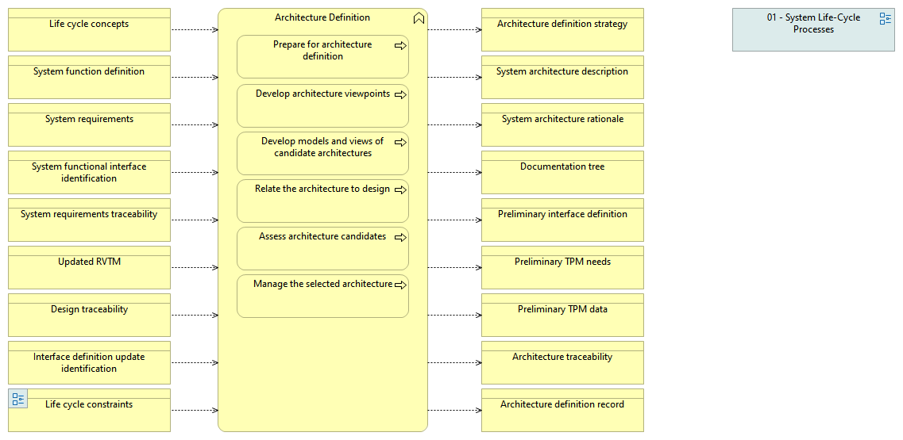

type:: [[Business function]]
source:: [[@Digital Systems Engineering Process Model Version: 1.0]]
documentation:: As stated in ISO/IEC/IEEE 15288, [6.4.4.1] The purpose of the Architecture Definition process is to generate system architecture alternatives, to select one or more alternative(s) that frame stakeholder concerns and meet system requirements, and to express this in a set of consistent views.  See detailed description in the INCOSE Handbook v.4, page 64.
inputs:: [[Life cycle concepts]]

-
- {:height 355, :width 711}