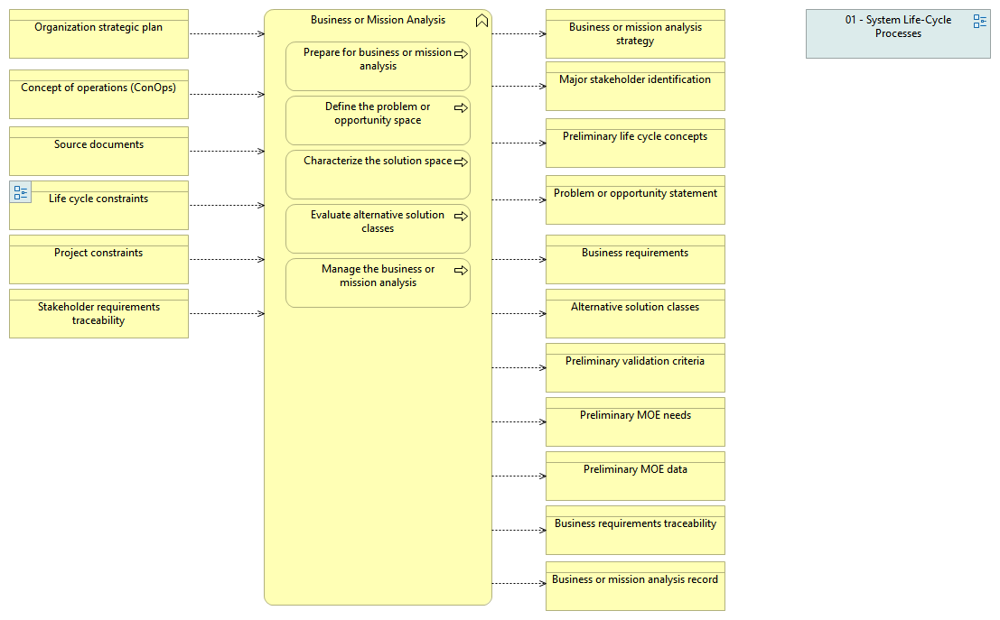

type:: [[Business function]]
source:: [[@Digital Systems Engineering Process Model Version: 1.0]]
documentation:: As stated in ISO/IEC/IEEE 15288, [6.4.1.1] The purpose of the Business or Mission Analysis process is to define the business or mission problem or opportunity, characterize the solution space, and determine potential solution class(es) that could address a problem or take advantage of an opportunity.  See detailed description in the INCOSE Handbook v.4, page 49.
inputs:: [[Organization strategic plan]], [[Concept of operations (ConOps)]], [[Source documents]], [[Life cycle constraints]], [[Project constraints]], [[Stakeholder requirements traceability]]
outputs:: [[Business or mission analysis strategy]],

-
-
- 
-