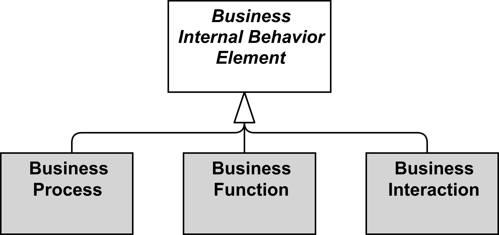

type:: [[Business internal behavior element]]
source:: [[@ArchiMate 3.2 Specification]]
definition:: A business process represents a sequence of business behaviors that achieves a specific result such as a defined set of products or business services.

- 
- 