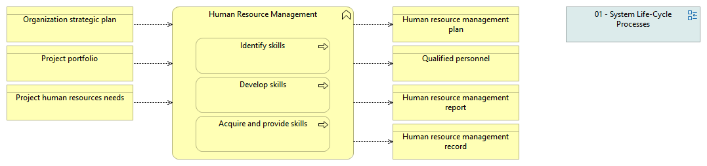

type:: [[Business function]]
source:: [[@Digital Systems Engineering Process Model Version 1]]
documentation:: As stated in ISO/IEC/IEEE 15288, [6.2.4.1] The purpose of the Human Resource Management process is to provide the organization with necessary human resources and to maintain their competencies, consistent with business needs.  See detailed description in the INCOSE Handbook v.4, page 154.
terraphimrole:: [[Employee]]
inputs:: [[Organization strategic plan]], [[Project portfolio]], [[Project human resources needs]]
outputs:: [[Human resource management plan]], [[Qualified personnel]], [[Human resource management report]], [[Human resource management record]]
activities:: [[Identify skills]], [[Develop skills]], [[Acquire and provide skills]]
synonyms:: 
relatedconcepts:: [[Performance review]]
issues::
sfiaskills:: [[Performance management]], [[Professional development]]

- {:height 176, :width 710}
-
-