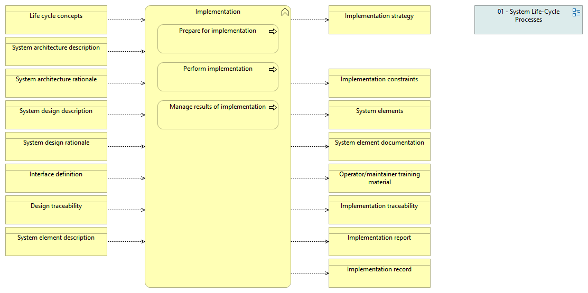

type:: [[Business function]]
source:: [[@Digital Systems Engineering Process Model Version: 1.0]]
documentation:: As stated in ISO/IEC/IEEE 15288, [6.4.7.1] The purpose of the Implementation process is to realize a specified system element.  See detailed description in the INCOSE Handbook v.4, page 77.
inputs:: [[Life cycle concepts]], [[System architecture description]], [[System architecture rationale]], [[System design description]], [[System design rationale]], [[Interface definition]], [[Design traceability]], [[System element description]]

- 