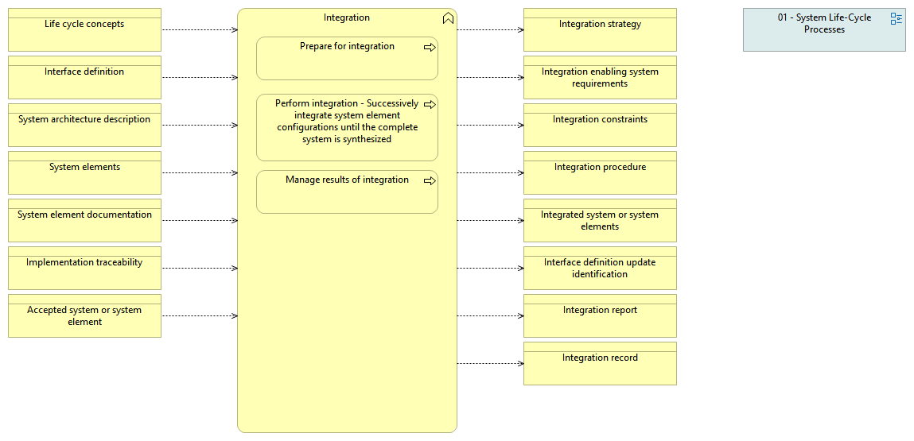

type:: [[Business function]]
source:: [[@Digital Systems Engineering Process Model Version: 1.0]]
documentation:: As stated in ISO/IEC/IEEE 15288, [6.4.8.1] The purpose of the Integration process is to synthesize a set of system elements into a realized system (product or service) that satisfies system requirements, architecture, and design.  See detailed description in the INCOSE Handbook v.4, page 79.
inputs:: [[Life cycle concepts]], [[Interface definition]], [[System architecture description]], [[System elements]], [[System element documentation]], [[Implementation traceability]], [[Accepted system or system element]]

- {:height 351, :width 711}