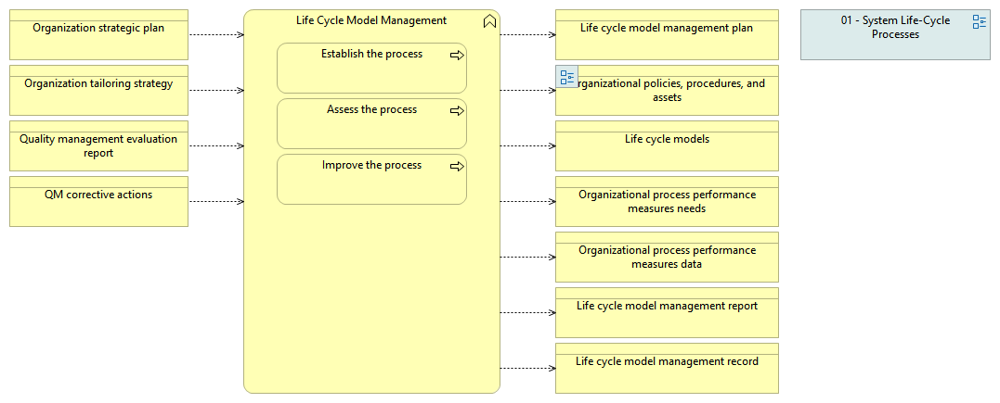

type:: [[Business function]]
source:: [[@Digital Systems Engineering Process Model Version 1]]
documentation:: As stated in ISO/IEC/IEEE 15288, [6.2.1.1] The purpose of the Life Cycle Model Management process is to define, maintain, and assure availability of policies, life cycle processes, life cycle models, and procedures for use by the organization with respect to the scope of [ISO/IEC/IEEE 15288].  See detailed description in the INCOSE Handbook v.4, page 145.
inputs:: [[Organization strategic plan]], [[Organization tailoring strategy]], [[Quality management evaluation report]], [[QM corrective actions]]
outputs:: [[Life cycle model management plan]], [[Organizational policies, procedures, and assets]], [[Life cycle models]], [[Organizational process performance measures needs]], [[Organizational process performance measures data]], [[Life cycle model management report]], [[Life cycle model management record]]
activities:: [[Establish the process]], [[Assess the process]], [[Improve the process]]

- 
-