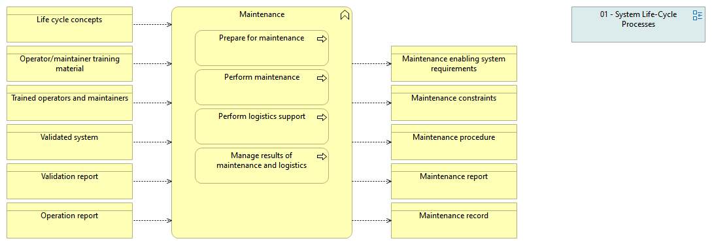

type:: [[Business function]]
source:: [[@Digital Systems Engineering Process Model Version: 1.0]]
documentation:: As stated in ISO/IEC/IEEE 15288, [6.4.13] The purpose of the Maintenance process is to sustain the capability of the system to provide a service.  See detailed description in the INCOSE Handbook v.4, page 97
inputs:: [[Operation report]], [[Life cycle concepts]], [[Validated system]], [[Trained operators and maintainers]], [[Validation report]], [[Operator or maintainer training material]]
outputs:: [[Maintenance record]], [[Maintenance constraints]], [[Maintenance procedure]], [[Maintenance report]], [[Maintenance enabling system]]
activities:: [[Prepare for maintenance]], [[Perform maintenance]], [[Perform logistics support]], [[Manage results of maintenance and logistics]]
synonyms::

- 
-