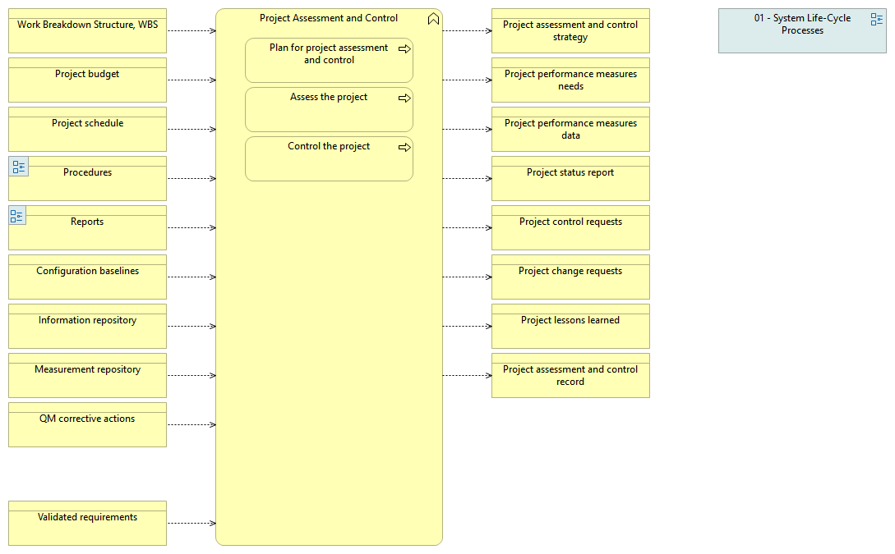

type:: [[Business function]]
source:: [[@Digital Systems Engineering Process Model Version: 1.0]]
documentation:: As stated in ISO/IEC/IEEE 15288, [6.3.2.1] The purpose of the Project Assessment and Control process is to assess if the plans are aligned and feasible.
inputs:: [[Work Breakdown Structure, WBS]], [[Project budget]], [[Project schedule]], [[Procedures]], [[Reports]], [[Configuration baselines]], [[Information repository]], [[Measurement repository]], [[QM corrective actions]], [[Validated requirements]]

- 