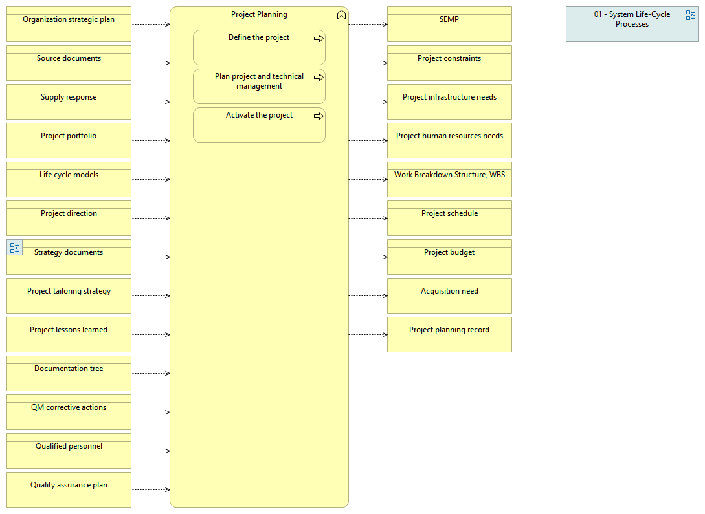

type:: [[Business function]]
source:: [[@Digital Systems Engineering Process Model Version: 1.0]]
documentation:: As stated in ISO/IEC/IEEE 15288, [6.3.1.1] The purpose of the Project Planning process is to produce and coordinate effective and workable plans.  See detailed description in the INCOSE Handbook v.4, page 104.
inputs:: [[Organization strategic plan]], [[Source documents]], [[Supply response]], [[Project portfolio]], [[Life cycle models]], [[Project direction]], [[Strategy documents]]

standards:: [[@INCOSE Systems Engineering Handbook: A Guide for System Life Cycle Processes and Activities]], [[@The Standard for Organizational Project Management]], [[@Practice Standard for Scheduling - Third Edition]], [[@PMI Lexicon of Project Management Terms]]
Synonyms:: planning of a project, planning of the project, planning of projects, planning projects, project design, project scheduling, project outline, project strategy, project proposal, project blueprint

