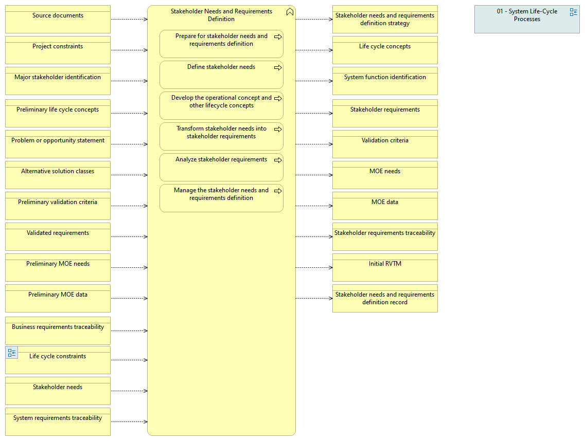

type:: [[Business function]]
source:: [[@Digital Systems Engineering Process Model Version: 1.0]]
documentation:: As stated in ISO/IEC/IEEE 15288, [6.4.2.1] The purpose of the Stakeholder Needs and Requirements Definition process is to define the stakeholder requirements for a system that can provide the capabilities needed by users and other stakeholders in a defined environment.  See detailed description in the INCOSE Handbook v.4, page 52.
inputs::

- 