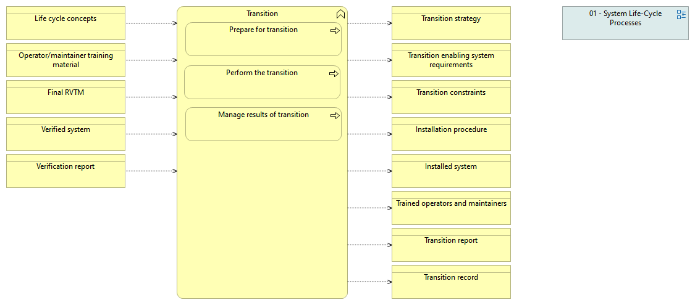

type:: [[Business function]]
source:: [[@Digital Systems Engineering Process Model Version: 1.0]]
documentation:: As stated in ISO/IEC/IEEE 15288, [6.4.10.1] The purpose of the Transition process is to establish a capability for a system to provide services specified by stakeholder requirements in the operational environment.  See detailed description in the INCOSE Handbook v.4, page 88.
inputs:: [[Life cycle concepts]], [[Operator or maintainer training material]], [[Final RVTM]], [[Verified system]], [[Verification report]]

- 