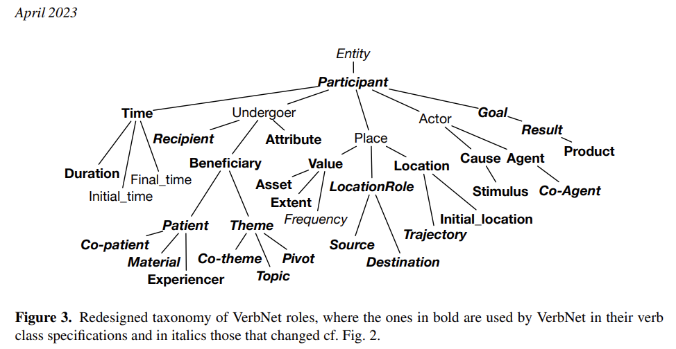

type:: [[TerraphimRole]]
topic:: [[Maintenance]]
cvposition:: [[Project manager R&D]].
startdate:: May 2011
duration:: 29 months
acquirer:: Production department of the S.-Petersburg plant Optogan.
customer:: Chief process and production control engineer.
end-user:: LED production line operators and process engineers.
theme:: X10 product R&D and launch, including smart-lighting horticulture product line.
end-user_material:: production line equipment, technology process instructions, maintenance procedures, chip- and wire-bonding equipment supply, and warranty contracts.
pivot:: no change required.
affectedlocations:: production floor at the places that where affected by changes because of results of the project or activity
affectedassets:: tools, infrastructure, and systems that changed due to performed activity
participants::
cause:: cause or justification of change, why the project or activity was ordered
goal::
result::

- 
-